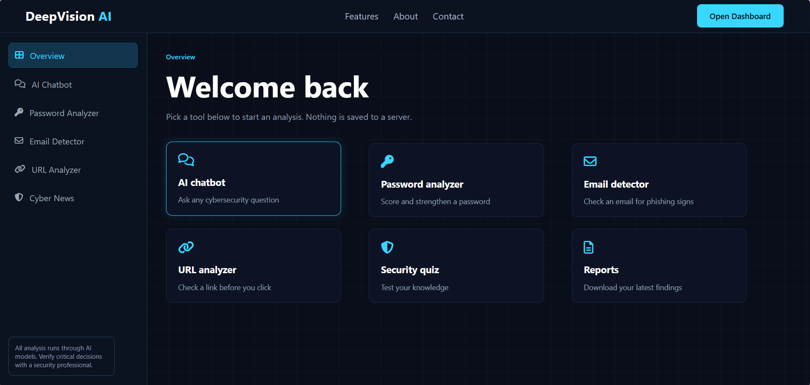
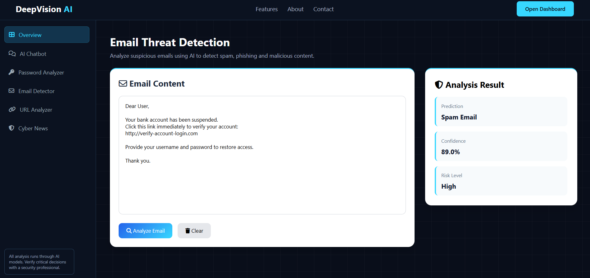
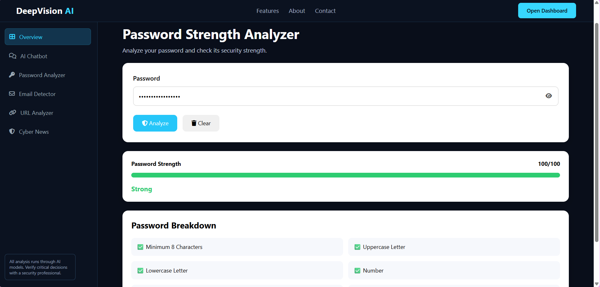
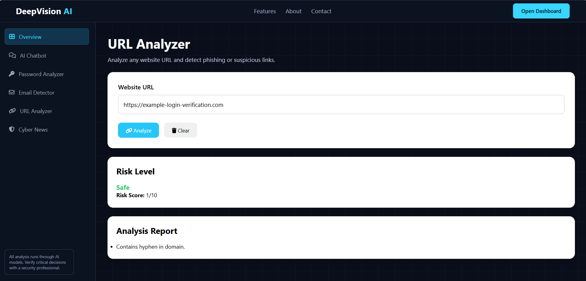
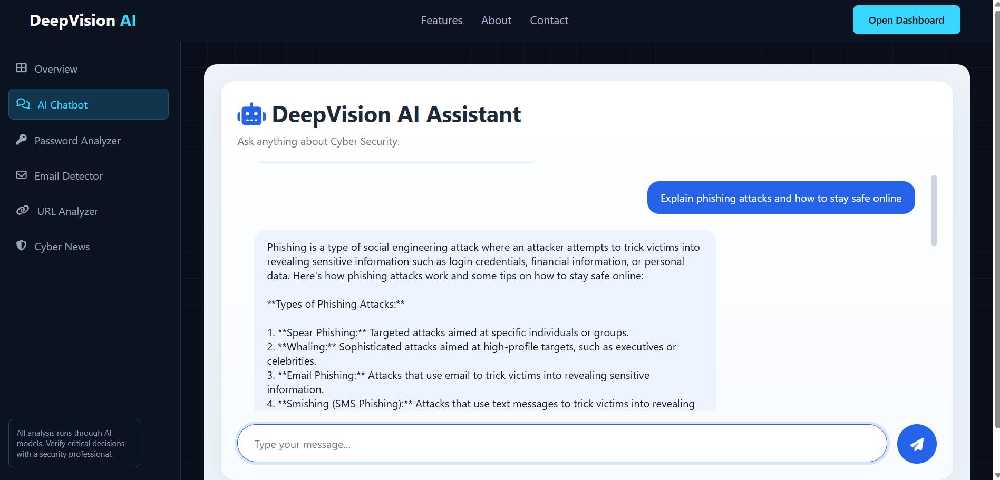
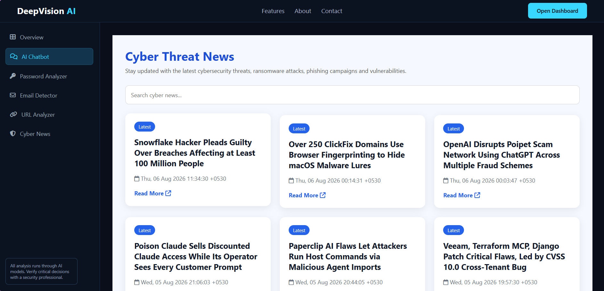

# 🛡️ DeepVision AI

> **An AI-powered cybersecurity platform for detecting threats, analyzing suspicious content, and improving cyber awareness.**

## 🌟 About DeepVision AI

**DeepVision AI** is a cybersecurity-focused AI application designed to help users understand and analyze common cyber threats.

The platform combines **Machine Learning, Natural Language Processing, AI, and Web Technologies** to provide multiple cybersecurity tools in one place.

### 💡 Inspired by Sandeep

DeepVision AI was **inspired and developed by Sandeep Badhan**, with the goal of creating a practical cybersecurity platform that combines AI with real-world security awareness.

---

## 🚀 Features

### 📧 Email Spam & Phishing Detection

Detect whether an email is potentially **spam or phishing** using a machine-learning pipeline.

### 🔐 Password Strength Analyzer

Analyze password strength and provide security feedback.

### 🔗 URL Security Analyzer

Analyze URLs for suspicious characteristics and potential security risks.

### 🤖 AI Cybersecurity Assistant

Ask cybersecurity-related questions and get AI-powered responses.

### 📰 Cybersecurity News

Stay updated with cybersecurity-related news and information.

---
## 📸 Screenshots

### 🏠 Dashboard



### 📧 Email Spam & Phishing Detection



### 🔐 Password Strength Analyzer



### 🔗 URL Security Analyzer



### 🤖 AI Cybersecurity Assistant



### 📰 Cybersecurity News


---

## 🛠️ Technologies Used

- Python
- Flask
- Machine Learning
- Natural Language Processing
- Scikit-learn
- Pandas
- NumPy
- HTML
- CSS
- JavaScript
- Ollama
- Llama 3.2

---

## 📂 Project Structure

```text
DeepVision-AI/
│
├── app.py
├── requirements.txt
├── README.md
│
├── src/
│   ├── chat/
│   ├── cyber_news/
│   ├── email.spam/
│   ├── password/
│   ├── pred_pipeline/
│   └── url/
│
├── static/
├── templates/
├── notebook/
└── artifacts/
```

---

# ⚙️ Installation & Setup

Follow these steps to run **DeepVision AI** on your local system.

## 1️⃣ Clone the Repository

Open Command Prompt, PowerShell, or VS Code Terminal and run:

```bash
git clone https://github.com/sandeepbadhan2006/DeepVision-AI.git
```

Then move into the project folder:

```bash
cd DeepVision-AI
```

## 2️⃣ Create a Virtual Environment

```bash
python -m venv .env
```

## 3️⃣ Activate the Virtual Environment

### Windows

```bash
.env\Scripts\activate
```

### Linux / macOS

```bash
source .env/bin/activate
```

After activation, you should see:

```text
(.env)
```

at the beginning of your terminal.

## 4️⃣ Upgrade pip

```bash
python -m pip install --upgrade pip
```

## 5️⃣ Install Project Dependencies

```bash
pip install -r requirements.txt
```

---

# 🤖 Ollama Setup

DeepVision AI uses **Ollama with Llama 3.2** for the AI cybersecurity assistant.

## 6️⃣ Install Ollama

Download and install Ollama from the official website:

https://ollama.com/

After installation, verify it:

```bash
ollama --version
```

## 7️⃣ Download Llama 3.2

Run:

```bash
ollama pull llama3.2
```

Check the installed models:

```bash
ollama list
```

You should see:

```text
llama3.2
```

---

# ▶️ Run the Application

## 8️⃣ Start DeepVision AI

Make sure the virtual environment is activated.

Run:

```bash
python app.py
```

The Flask application will start locally.

## 9️⃣ Open the Application

Open your web browser and visit:

```text
http://127.0.0.1:5000
```

You can now use **DeepVision AI**.

---

## 🔐 Security Note

Do not upload API keys, passwords, `.env` files, virtual environments, or other sensitive information to GitHub.

Large datasets and trained model files are excluded from the repository because of GitHub file-size limitations.

---

## 🎯 Project Objective

The main objective of **DeepVision AI** is to provide a unified cybersecurity platform where users can:

- Detect suspicious emails
- Analyze potentially unsafe URLs
- Check password strength
- Ask cybersecurity questions
- Improve cybersecurity awareness

---

## 🔮 Future Improvements

- Real-time threat intelligence
- Advanced phishing detection
- Improved AI cybersecurity assistant
- User authentication
- Security reports
- Cloud deployment
- Real-time URL reputation checking
- Advanced threat detection models

---

## 👨‍💻 Developer

**Sandeep Badhan**

B.Tech Computer Science Engineering

### 💙 Built with Python, AI & Cybersecurity

**DeepVision AI — Inspired by Sandeep.**
